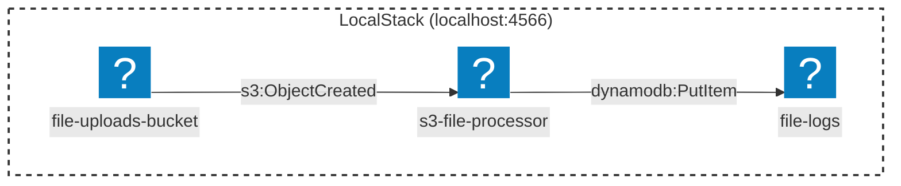

# AWS DynamoDB

This project demonstrates a file processing pipeline where S3 uploads trigger a Lambda to log metadata into a DynamoDB table.


[](vscode:extension/mermaidchart.vscode-mermaid-chart)

## Index

- [Quickstart (Dev Container)](#quickstart-dev-container)
- [Step by Step (without Dev Container)](#step-by-step-without-dev-container)
    - [1. Start Infrastructure](#1-start-infrastructure)
    - [2. Configure AWS CLI](#2-configure-aws-cli)
    - [3. Install AWS Toolkit](#3-install-aws-toolkit)
    - [4. Install Python](#4-install-python)
    - [5. Deploy Resources](#5-deploy-resources)
    - [6. Run the Example](#6-run-the-example)
    - [7. Validation](#7-validation)
    - [8. Clean Up](#8-clean-up)
- [Troubleshooting](#troubleshooting)
- [License](#license)

## Quickstart (Dev Container)

The Dev Container automatically provisions the LocalStack infrastructure and configures the Python environment and AWS CLI for immediate use.

1. **Prerequisites:**
    1. [Docker](https://www.docker.com/get-started) installed and running.
    2. [Dev Containers extension](vscode:extension/ms-vscode-remote.remote-containers) installed.

2. **Open project:** Open the **Command Palette** (`F1` or `Ctrl/Cmd+Shift+P`), also accessible via **View > Command Palette**, and select **Dev Containers: Reopen in Container**.
3. **Run MVE:** 
   ```bash
   python main.py
   ```
4. **List buckets**:
    ```bash
    aws s3 ls
    ```
5. **Scan DynamoDB table**:
   ```bash
   aws dynamodb scan --table-name file-logs
   ```
6. **Clean up:**
   ```bash
   docker compose down -v
   ```

## Step by Step (without Dev Container)

This section details the steps performed automatically within the Dev Container, exploring additional variations and deployment options.

### 1. Start Infrastructure

To start only the **LocalStack** service (avoiding the development container), run:

```bash
docker compose up -d localstack
```

### 2. Configure AWS CLI

Install the [AWS CLI](https://docs.aws.amazon.com/cli/latest/userguide/getting-started-install.html) and configure a dedicated profile to point to your LocalStack instance:

```bash
aws configure set aws_access_key_id test --profile localstack
aws configure set aws_secret_access_key test --profile localstack
aws configure set region us-east-1 --profile localstack
aws configure set output json --profile localstack
aws configure set endpoint_url http://localhost:4566 --profile localstack
aws configure set cli_pager "" --profile localstack
```

### 3. Install AWS Toolkit

Install the [AWS Toolkit](vscode:extension/amazonwebservices.aws-toolkit-vscode) extension. To use it with LocalStack:

1. Open the **AWS Toolkit** explorer in VS Code.
2. Click on the **Profiles** or **Connections** settings.
3. Select the `localstack` profile configured in step 2.

### 4. Install Python

Install [Python](https://www.python.org/downloads/) and verify the installation:

```bash
python --version
```

Then, install [uv](https://github.com/astral-sh/uv) and sync dependencies to create the virtual environment:

```bash
pip install uv
uv sync
```

### 5. Deploy Resources

Before deploying, you must package the Lambda function:

```bash
python deploy/utils/package_lambda.py
```

Choose your preferred Infrastructure as Code (IaC) tool:

> 💡 **Note:** If you switch between **Terraform** and **CloudFormation**, ensure you perform a **Clean Up** first. Both methods use the same resource names, and deploying one without removing the other will result in "Resource Already Exists" errors.

* **Option A**: Terraform

   ```bash
   terraform -chdir=deploy init
   terraform -chdir=deploy apply -auto-approve
   ```

* **Option B**: CloudFormation

   ```bash
   # 1. Create a temporary bucket for deployment
   aws s3 mb s3://lambda-deploy-bucket --profile localstack

   # 2. Upload the Lambda package
   aws s3 cp tmp/lambda.zip s3://lambda-deploy-bucket/lambda.zip --profile localstack

   # 3. Deploy the stack
   aws cloudformation deploy --profile localstack \
     --stack-name aws-dynamo-db-stack \
     --template-file deploy/cloud_formation.yaml \
     --capabilities CAPABILITY_NAMED_IAM
   ```

### 6. Run the Example

* **Option A**: Python Script. Run the demonstration script to upload sample files and view the logs:

   ```bash
   python main.py
   ```

* **Option B**: Manual Upload (CURL). You can also trigger the Lambda manually by uploading any file via `curl`:

   ```bash
   curl -X PUT -T src/lambda.py http://localhost:4566/file-uploads-bucket/manual-upload.py
   ```

* **Option C**: AWS Toolkit. You can browse resources and even upload files directly from the IDE:
    1. Select the `localstack` profile in the AWS Toolkit.
    2. To trigger the example, right-click on the `file-uploads-bucket` and select **Upload Files...**.

### 7. Validation

Choose your preferred way to verify the results:

* **Option A**: AWS CLI. Verify that the files were uploaded and the logs were created:
    - **Check S3 Bucket**:
      ```bash
      aws s3 ls s3://file-uploads-bucket --profile localstack
      ```
    - **Scan DynamoDB Table**:
      ```bash
      aws dynamodb scan --table-name file-logs --profile localstack
      ```
    - **View Lambda Logs**:
      ```bash
      aws logs tail /aws/lambda/s3-file-processor --profile localstack
      ```

* **Option B**: AWS Toolkit. Browse the resources directly from the VS Code sidebar:
    1. **S3**: Expand the S3 section to see the uploaded files.
    2. **DynamoDB**: Expand the DynamoDB section and click on the `file-logs` table to see the records.
    3. **CloudWatch**: Expand the Logs section to see the Lambda execution output.

### 8. Clean Up

To completely remove the local infrastructure:

```bash
docker compose down -v
```

## Troubleshooting

| Issue | Solution |
| :--- | :--- |
| **Connection Refused** | Ensure LocalStack is running and wait for the `Ready.` message in logs. |
| **Lambda Not Triggering** | Verify logs: `aws logs tail /aws/lambda/s3-file-processor --profile localstack` |

## License

This is a minimal example for educational purposes. Feel free to use and modify as needed.
