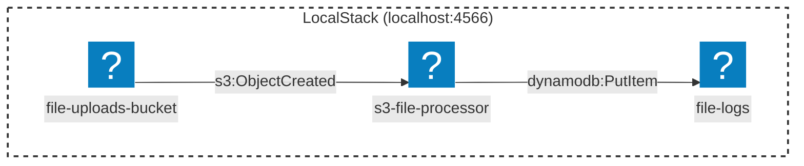

# AWS DynamoDB

This project demonstrates a file processing pipeline where S3 uploads trigger a Lambda to log metadata into a DynamoDB table.


[](vscode:extension/mermaidchart.vscode-mermaid-chart)

## Quickstart (Dev Container)

1. **Prerequisites:**
    1. [Docker](https://www.docker.com/get-started) installed and running.
    2. [Dev Containers extension](vscode:extension/ms-vscode-remote.remote-containers) installed.

2. **Open project:** Open the **Command Palette** (`F1` or `Ctrl/Cmd+Shift+P`), also accessible via **View > Command Palette**, and select **Dev Containers: Reopen in Container**.
3. **Deploy Infrastructure:**
   ```bash
   docker compose up -d && python package_lambda.py
   terraform init && terraform apply -auto-approve 
   ```
4. **Run MVE:** 
   ```bash
   python main.py
   ```
5. **List buckets**:
    ```bash
    aws --endpoint-url=http://localhost:4566 s3 ls
    ```
6. **Scan DynamoDB table**:
   ```bash
   aws --endpoint-url=http://localhost:4566 dynamodb scan --table-name file-logs
   ```

## Option 2: Local Setup (Without Dev Container)

### Step 1: Install Dependencies

1. Install **Terraform** (if using it) or **AWS CLI**.
2. Install Python dependencies:
   ```bash
   pip3 install uv && uv sync
   ```

### Step 2: Start LocalStack

```bash
docker compose up -d
```

### Step 3: Package and Deploy

Follow the same instructions as in the Dev Container section (**Step 3** and **Step 4**).

### Step 4: Run the Example

```bash
python main.py
```

## Project Components

### Lambda Function (`lambda_function.py`)

A Python function that:
- Triggered by S3 `ObjectCreated` events.
- Extracts file metadata (name, size, timestamp).
- Writes a record to the DynamoDB table.

### Infrastructure as Code

- **`main.tf`**: Provisions a bucket, a table, and the Lambda function using Terraform.
- **`cloud_formation.yaml`**: Provisions the same resources using an AWS CloudFormation template.

### Demo Script (`main.py`)

- Uploads diverse sample files (PDF, Image, JSON) to the S3 bucket.
- Waits for the asynchronous Lambda execution.
- Scans the DynamoDB table to display the processing logs.

## Environment Variables

The `.env` file contains:

```
AWS_ACCESS_KEY_ID=test
AWS_SECRET_ACCESS_KEY=test
AWS_DEFAULT_REGION=us-east-1
ENDPOINT_URL=http://localhost:4566
BUCKET_NAME=file-uploads-bucket
DYNAMODB_TABLE_NAME=file-logs
```

**Note**: LocalStack uses 'test' credentials by default. The `BUCKET_NAME` variable should match the one defined in your chosen IaaC (Terraform uses `file-uploads-bucket`, CloudFormation uses `file-uploads-bucket-cf`).

## Useful Commands

### Docker Commands

```bash
# Start services
docker compose up -d

# View logs
docker compose logs -f

# Stop services
docker compose down -v
```

### AWS CLI (LocalStack)

```bash
# List buckets
aws --endpoint-url=http://localhost:4566 s3 ls

# Scan DynamoDB table
aws --endpoint-url=http://localhost:4566 dynamodb scan --table-name file-logs
```

## Troubleshooting

### Connection Refused

Ensure LocalStack is running and wait until the log shows `Ready.`.

### Lambda Not Triggering

Check the Lambda logs using:
```bash
aws --endpoint-url=http://localhost:4566 logs tail /aws/lambda/s3-file-processor
```

## Clean Up

- **Terraform**: `terraform destroy -auto-approve`
- **CloudFormation**: `aws --endpoint-url=http://localhost:4566 cloudformation delete-stack --stack-name aws-dynamo-db-stack`

## Next Steps

- Add SNS notifications for processing failures.
- Implement file content validation inside the Lambda.
- Explore LocalStack AWS Web Console at [app.localstack.cloud](https://app.localstack.cloud).

## License

This is a minimal example for educational purposes. Feel free to use and modify as needed.
