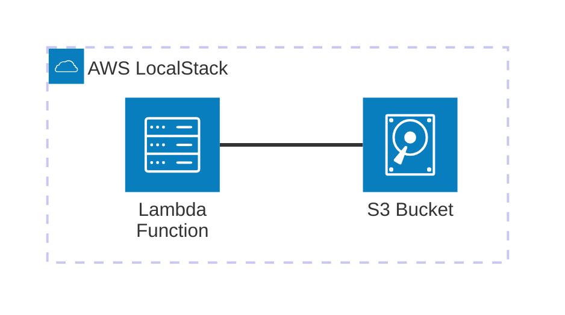

# AWS Lambda

Ejemplo mínimo viable de una función **AWS Lambda** que sube archivos a **S3**. Diseñado para ejecutarse 100% localmente usando **LocalStack**.

## Arquitectura



[](vscode:extension/mermaidchart.vscode-mermaid-chart)

## Índice

- [Inicio Rápido (Dev Container)](#inicio-rápido-dev-container)
- [Paso a Paso (sin Dev Container)](#paso-a-paso-sin-dev-container)
    - [1. Iniciar infraestructura](#1-iniciar-infraestructura)
    - [2. Configurar AWS CLI](#2-configurar-aws-cli)
    - [3. Instalar AWS Toolkit](#3-instalar-aws-toolkit)
    - [4. Instalar Python](#4-instalar-python)
    - [5. Desplegar recursos](#5-desplegar-recursos)
    - [6. Ejecutar el ejemplo](#6-ejecutar-el-ejemplo)
    - [7. Validación](#7-validación)
    - [8. Limpieza](#8-limpieza)
- [Solución de problemas](#solución-de-problemas)
- [Licencia](#licencia)

---

## Inicio Rápido (Dev Container)

El Dev Container provisiona automáticamente la infraestructura de LocalStack y configura el entorno Python y AWS CLI para su uso inmediato.

1. **Prerrequisitos:**
    1. [Docker](https://www.docker.com/get-started) instalado y ejecutándose.
    2. [Extensión Dev Containers](vscode:extension/ms-vscode-remote.remote-containers) instalada.

2. **Abrir proyecto:** Abre la **Paleta de Comandos** (`F1` o `Ctrl/Cmd+Shift+P`), también accesible vía **Ver > Paleta de Comandos**, y selecciona **Dev Containers: Reopen in Container**.
3. **Ejecutar MVE:** 
   ```bash
   python main.py
   ```
4. **Verificar subida:**
   ```bash
   aws s3 ls s3://test-bucket/
   ```
5. **Limpieza:**
   ```bash
   docker compose down -v
   ```

## Paso a Paso (sin Dev Container)

Esta sección detalla los pasos realizados automáticamente dentro del Dev Container, explorando variaciones adicionales y opciones de despliegue.

### 1. Iniciar infraestructura

Para iniciar solo el servicio de **LocalStack** (evitando el contenedor de desarrollo), ejecuta:

```bash
docker compose up -d localstack
```

### 2. Configurar AWS CLI

Instala el [AWS CLI](https://docs.aws.amazon.com/es_es/cli/latest/userguide/getting-started-install.html) y configura un perfil dedicado para apuntar a tu instancia de LocalStack:

```bash
aws configure set aws_access_key_id test --profile localstack
aws configure set aws_secret_access_key test --profile localstack
aws configure set region us-east-1 --profile localstack
aws configure set output json --profile localstack
aws configure set endpoint_url http://localhost:4566 --profile localstack
aws configure set cli_pager "" --profile localstack
```

### 3. Instalar AWS Toolkit

Instala la extensión [AWS Toolkit](vscode:extension/amazonwebservices.aws-toolkit-vscode). Para usarla con LocalStack:

1. Abre el explorador de **AWS Toolkit** en VS Code.
2. Haz clic en la configuración de **Profiles** o **Connections**.
3. Selecciona el perfil `localstack` configurado en el paso 2.

### 4. Instalar Python

Instala [Python](https://www.python.org/downloads/) y verifica la instalación:

```bash
python --version
```

Luego, instala [uv](https://github.com/astral-sh/uv) y sincroniza las dependencias para crear el entorno virtual:

```bash
pip install uv
uv sync
```

### 5. Desplegar recursos

Antes de desplegar, debes empaquetar la función Lambda:

```bash
python deploy/utils/package_lambda.py
```

Elige tu opción de despliegue preferida:

💡 **Nota:** Si cambias entre diferentes métodos de despliegue (**Terraform**, **CloudFormation** o **Boto3**), asegúrate de realizar una **Limpieza** primero para evitar conflictos de nombres de recursos.

* **Opción A**: Terraform

   ```bash
   terraform -chdir=deploy init
   terraform -chdir=deploy apply -auto-approve
   ```

* **Opción B**: CloudFormation

   ```bash
   # 1. Crear un bucket temporal para el despliegue
   aws s3 mb s3://lambda-deploy-bucket --profile localstack

   # 2. Subir el paquete de la Lambda
   aws s3 cp deploy/dist/function.zip s3://lambda-deploy-bucket/lambda.zip --profile localstack

   # 3. Desplegar el stack
   aws cloudformation deploy --profile localstack \
     --stack-name aws-lambda-stack \
     --template-file deploy/cloud_formation_deploy.yaml \
     --capabilities CAPABILITY_NAMED_IAM
   ```

   > 🎨 **Consejo:** Puedes visualizar esta plantilla usando **AWS Infrastructure Composer** desde **AWS Toolkit** abriendo `deploy/cloud_formation_deploy.yaml` y haciendo clic en el botón "Infrastructure composer" en la esquina superior derecha del editor.

* **Opción C**: Boto3 (Python)

   ```bash
   python deploy/boto3_deploy.py
   ```

* <details><summary><b>Opción D</b>: AWS CLI (Manual) - Haz clic para expandir</summary>

   ```bash
   # 1. Crear Rol de IAM
   aws iam create-role --profile localstack \
     --role-name lambda-s3-role \
     --assume-role-policy-document '{"Version":"2012-10-17","Statement":[{"Effect":"Allow","Principal":{"Service":"lambda.amazonaws.com"},"Action":"sts:AssumeRole"}]}'

   # 2. Crear Función Lambda
   aws lambda create-function --profile localstack \
     --function-name upload-to-s3 \
     --runtime python3.12 \
     --role arn:aws:iam::000000000000:role/lambda-s3-role \
     --handler lambda.lambda_handler \
     --zip-file fileb://deploy/dist/function.zip \
     --environment Variables={ENDPOINT_URL=http://localhost:4566}

   # 3. Crear Bucket de S3
   aws s3 mb s3://test-bucket --profile localstack
   ```
</details>

### 6. Ejecutar el ejemplo

* **Opción A**: Script de Python. Ejecuta el script de demostración para invocar la Lambda y verificar la subida:

   ```bash
   python main.py
   ```

* **Opción B**: AWS Toolkit. Puedes explorar los recursos y activar la Lambda directamente desde el IDE:
    1. Selecciona el perfil `localstack` en el AWS Toolkit.
    2. Para activar el ejemplo, haz clic derecho en la función `upload-to-s3` y selecciona **Invoke Lambda...**.

---

### 7. Validación

Elige tu forma preferida de verificar los resultados:

* **Opción A**: AWS CLI. Verifica que el archivo se ha subido correctamente:
    - **Check S3 Bucket**:
      ```bash
      aws s3 ls s3://test-bucket/ --profile localstack
      ```
    - **Ver Logs de Lambda**:
      ```bash
      aws logs tail /aws/lambda/upload-to-s3 --profile localstack
      ```

* **Opción B**: AWS Toolkit. Explora los recursos directamente desde la barra lateral de VS Code:
    1. **S3**: Expande la sección S3 para ver los archivos subidos.
    2. **CloudWatch**: Expande la sección de Logs para ver la salida de ejecución de la Lambda.

---

### 8. Limpieza

Para eliminar completamente la infraestructura local:

```bash
docker compose down -v
```

## Solución de problemas

| Problema | Solución |
| :--- | :--- |
| **Timeout de Lambda** | Asegúrate de que LocalStack tenga suficientes recursos de memoria/CPU. |
| **Conexión rechazada** | Asegúrate de que LocalStack esté ejecutándose y espera al mensaje `Ready.` en los logs. |

## Licencia

Este es un ejemplo mínimo para fines educativos. Siéntete libre de usarlo y modificarlo según sea necesario.
